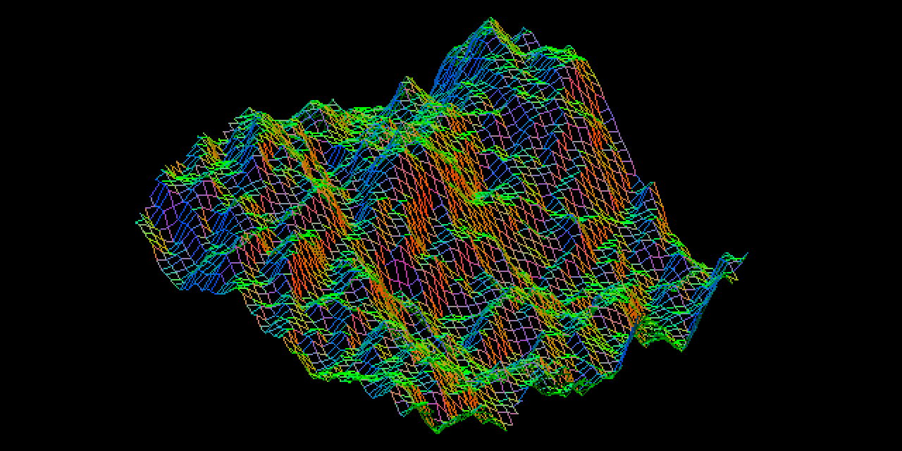
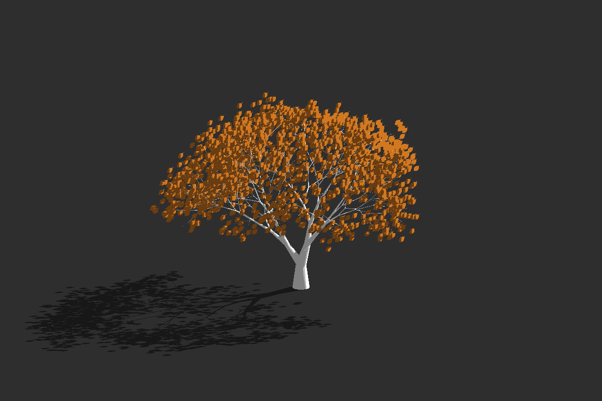
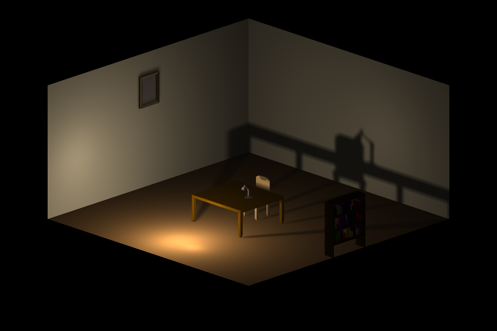
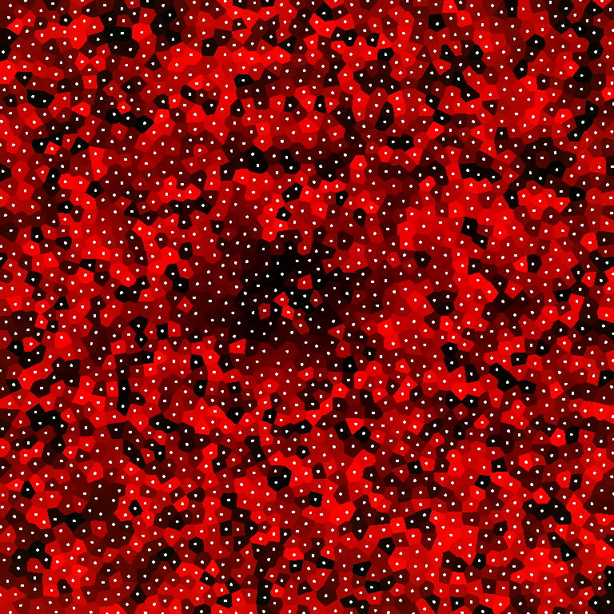

# TinyEngine

Small OpenGL based 2D/3D Engine / Wrapper in C++

Simple generated perlin-noise heightmap rendered with normal vectors as colors (Example Program 2)

	LINES OF CODE (without unreasonable compression):

		Main File: 103
		Main Classes: 264
		Utility Classes: 579
		Helpers Namespaces: 199
		Total: 1145

	History:
		12. Apr 2020: 885
		29. Apr 2020: 1116
		17. May 2020: 1667
		23. May 2020: 1065
                01. Aug 2020: 1145
                21. Feb 2021: 1378

## Description
Based on many previous OpenGL projects, I have a good idea of what features I need in an engine to build visually appealing visualizations of generated data. Many of the projects had the same overarching structure, and used the same OpenGL wrapping structures. This engine unifies those basic concepts.

The goal of this "engine" is to act as an intuitive wrapper for boilerplate OpenGL, allowing for quick and easy development of 2D / 3D visualizations of generated data. I also want to keep it as small as possible, giving only necessary abstractions of boilerplate OpenGL code, and doing the rest with user-defined behaviors passed to the engine.

This is also a learning project, for practicing engine / systems design. This is not intended as an optimized game development library, but can be used to generate beatiful visualizations of generated data.

If anybody likes the structure, they are free to adopt it or recommended additions / changes.

As I continue to build projects using this engine, I plan on slowly expanding its feature set, as long as new features fit elegantly into the overall structure and offer a large amount of functionality for little additional effort.

Animated Julia-Set (Example 4). See my blog [here](https://weigert.vsos.ethz.ch/2020/04/14/animated-multi-julia-sets/).

## Structure
The main engine interface is wrapped in a namespace `Tiny`. This namespace has three (global) static members, which are its main component classes:

	- View Class (Tiny::view): 	Window handling, rendering, GUI interface
	- Event Class (Tiny::event): 	Event handling for keyboard and mouse, window resizing
	- Audio Class (Tiny::audio): 	Audio interface for playing / looping sounds

A number of utility classes wrap typical OpenGL features into easily useable structures. These have simple constructors and destructors that wrap the necessary OpenGL so you don't have to worry about it:

	- Texture: 	OpenGL texture wrapper with constructors for different data types (e.g. algorithm, raw image, ...)
	- Shader: 	Load, compile, link and use shader programs (vertex, fragment, geometry) easily, pass SSBO.
	- Model: 	OpengL VAO/VBO wrapper. Construct from user-defined algorithm. Handles loading, updating, rendering.
	- Target: 	OpenGL FBO wrapper. Bind a texture for render targeting. Handles 2D (billboards) and 3D (cubemaps).
	- Instance: 	OpenGL instanced rendering wrapper (any Model object, any data). Simply add model buffers and render model instanced.

More information can be found on the wiki: [Utility Classes](https://github.com/weigert/TinyEngine/wiki/Utility-Classes)

The behavior is combined through a standard game pipeline. The programs behavior is additionally changed through user-defined functions which are called in the relevant parts of the pipeline:

	- Tiny::event.handler: 	Lets you define behavior based on user-inputs. Tiny::event stores input data
	- Tiny::view.interface: Lets you define an ImGUI interface that can act on your data structures
	- Tiny::view.pipeline: 	Combines utility classes to render your data structures to targets / windows
	- Tiny::loop: 		Executed every cycle. Arbitrary code acting on your data structures every loop

A number of helper namespaces then supply additional algorithms and functions that are useful.

## Example Images

All of the programs shown below are highly interactive and allow for live manipulation of the scene. All of them run in real time and allow for camera movement. Read the very brief example programs to see how TinyEngine is used to construct nice visualizations using very little code.

A procedural 3D tree (example program 6), that has a leaf particle system and orthogonal projection shadow mapping.

A simple scene (example program 9) that uses .obj / .mtl files generated in Blender, and then uses cubemaps for point-light shading.

An example image of a shader-based voronoi texture generator I implemented as a small experiment (example program 11). Lets you do real-time voronoi filters because its very fast. Here seen for N = 2048. See [my blog here here](https://weigert.vsos.ethz.ch/2020/08/01/gpu-accelerated-voronoi-textures-and-filters/).

A rendering of a dynamic alpha-blended voxel scene which uses a technique called vertex pooling to reduce driver overhead while drawing. See [my blog here](https://weigert.vsos.ethz.ch/2021/04/04/high-performance-voxel-engine/)

## Usage
As the code-base is extremely brief, I recommend reading through the code and the example programs to understand how it works. The Wiki contains more information on the individual functions of the classes and how they are used.

### Constructing a Program
Building a program with TinyEngine is extremely simple!

Example Program 0:

    #include <TinyEngine/TinyEngine>

    int main( int argc, char* args[] ) {

		Tiny::window("Example Window", 600, 400);   //Open Window

		Tiny::event.handler = [&](){ /*...*/ };   //Define Event Handler

		Tiny::view.interface = [&](){ /*...*/ };  //Define ImGUI Interface

		/*...Define Utility Classes...*/

		Tiny::view.pipeline = [&](){ /*...*/ };   //Define Rendering Pipeline

		Tiny::loop([&](){ //Start Main Game Loop
            		//... additional code here
		});

		Tiny::quit(); //Close the window, cleanup

		return 0;
    }

Check the [TinyEngine Wiki](https://github.com/weigert/TinyEngine/wiki) for more information on how to construct a basic program. Read the example programs to see how the utility classes are combined to create interactive 2D and 3D programs using OpenGL in very little code.

### Compiling and Linking
As of 2021, TinyEngine is built as a statically linked library for easier inclusion in your project. This has a number of benefits:
- TinyEngine does not need to be copied into your project directory
- Easier continuous maintenance and updating
- Faster compilation times

The installation process occurs in the makefile:

		sudo make setup     #Copy Core Header Files to Install Location
		sudo make helpers   #Copy Helper Headers
		sudo make install   #Compile TinyEngine and Copy to Install Location
		sudo make all       #All of the above! Run this for easy install.

The default install locations are `/usr/local/lib` for the compiled library and `/usr/local/include` for the header files.

Check the (brief!) makefile for options (e.g. install location, compiler flags).

Note that the installation has only been tested on GNU/Linux and install locations might need tuning for your system.

#### Building a Project
Building a project by default only requires inclusion of the TinyEngine header

		#inlude <TinyEngine/TinyEngine>

and optionally any helper namespace headers, e.g.

		//...
		#include <TinyEngine/object>
		#include <TinyEngine/image>
		//...

TinyEngine standalone is linked using:

		-lTinyEngine

but also requires linking of all additional dependencies! See the example programs to see exactly how to link the program (makefile). Note that all makesfiles are identical!

Compiled using g++ on Ubuntu 18/20 LTS.

### Dependencies
(+ how to install on debian based systems)

    - OpenGL3: apt-get install libglu1-mesa-dev
    - SDL2:    apt-get install libsdl2-dev libsdl2-ttf-dev libsdl2-mixer-dev libsdl2-image-dev
    - GLEW:    apt-get install libglew-dev
    - Boost:   apt-get install libboost-system-dev libboost-filesystem-dev
    - GLM:     apt-get install libglm-dev

    - DearImGUI (already included!)
    - g++ (compiler)

In a single command:

		sudo apt-get install libglu1-mesa-dev libsdl2-dev libsdl2-ttf-dev libsdl2-mixer-dev libsdl2-image-dev libglew-dev libboost-system-dev libboost-filesystem-dev libglm-dev

Currently TinyEngine has only been tested on linux (Ubuntu 18 LTS). It would be possible to port to windows, but I lack a dedicated windows development environment to reliably port it. I might do this in the future.  

## License
MIT License
